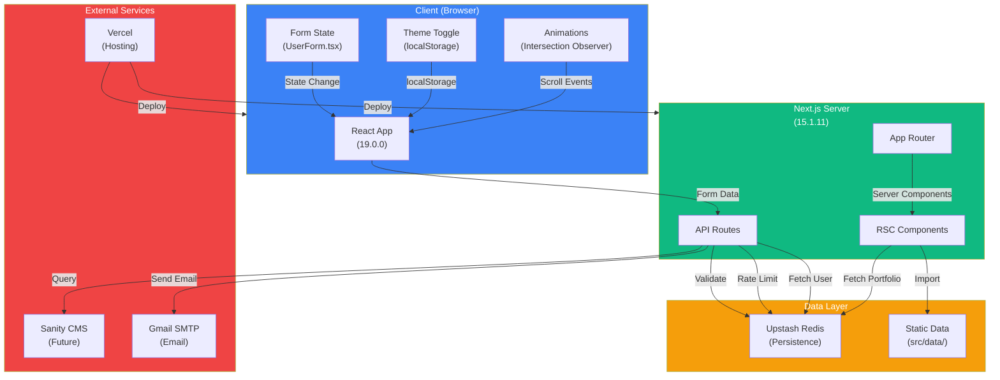
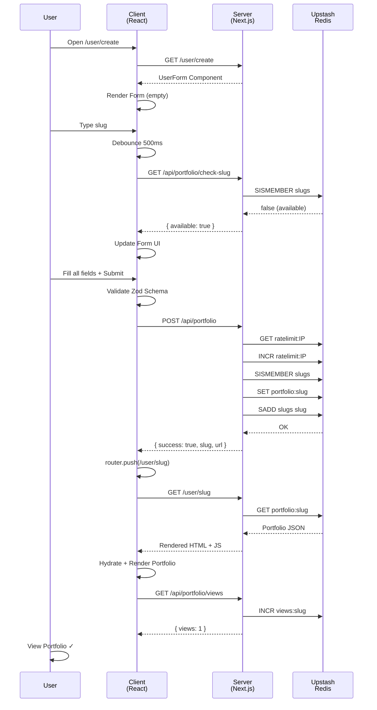

# Next.js Portfolio Builder — Complete Technical Documentation

## 1. Project Overview

### What the Application Does

**portfolio** is a **multi-tenant SaaS platform** that enables users to generate and deploy fully personalized portfolio websites without writing code. Each user submits a structured form, receives a unique live URL (e.g., `/user/sahilahuja1729`), and gets a deployed portfolio with independent theming, responsive design, and a reusable component architecture.

Key differentiator: Instead of a static "view my portfolio" site, this is a **platform** where any user can fill a form and instantly get their own portfolio deployed at a live URL. Multiple users have already built live portfolios in production.

### Problem It Solves

1. **Reduces barrier to entry** — Non-technical users can create professional portfolios without touching code
2. **Eliminates copy-paste fatigue** — Fixed form schema ensures consistency across all generated portfolios
3. **Demonstrates multi-tenant architecture** — Mirrors production SaaS patterns (dynamic theming per tenant, reusable components, per-user data isolation)
4. **Scalability out of the box** — New user portfolios are instantly live at unique URLs; no manual deployment needed

### Architecture Type

- **Next.js 15.1.11 with App Router** — all routing happens in `src/app/`
- **Hybrid rendering**:
  - Server components (RSC) for layout shells and pure display components
  - Client components for interactivity (forms, animations, theme toggles)
  - Server actions for email handling
- **No Pages Router** — fully committed to App Router

---

## 2. Tech Stack

### Versions

| Component  | Version                          |
| ---------- | -------------------------------- |
| Next.js    | 15.1.11 (latest with Turbopack)  |
| React      | 19.0.0                           |
| TypeScript | 5.x                              |
| Node       | 18+ (inferred from package.json) |

### Core Libraries

| Purpose                 | Library                   | Version | Usage                                                    |
| ----------------------- | ------------------------- | ------- | -------------------------------------------------------- |
| **Form Validation**     | Zod                       | 3.23.8  | Single source of truth for portfolio schema validation   |
| **State Management**    | React hooks               | Native  | useFormArray, useSlugValidation, useScrollAnimation      |
| **Data Persistence**    | Upstash Redis             | 1.34.3  | Store/retrieve portfolios, rate limiting, view analytics |
| **Email Service**       | Nodemailer                | 6.9.16  | Contact form emails via Gmail SMTP                       |
| **CMS (Planned)**       | Sanity                    | 3.69.0  | Configured but not yet integrated into main flow         |
| **PDF Generation**      | @react-pdf/renderer       | 4.1.6   | Resume PDF export (infrastructure ready)                 |
| **Styling**             | Tailwind CSS              | 3.4.1   | Utility-first responsive design                          |
| **UI Animations**       | tailwindcss-animate       | 1.0.7   | Smooth transitions and keyframes                         |
| **Icons & Graphics**    | lucide-react, react-icons | Latest  | SVG icons for social links and UI                        |
| **Carousel**            | embla-carousel-react      | 8.5.2   | Project showcase carousel                                |
| **Markdown Editor**     | @uiw/react-md-editor      | 4.0.5   | For future content editing                               |
| **Component Utilities** | clsx, tailwind-merge      | Latest  | className management without conflicts                   |

### Infrastructure & Deployment

| Layer          | Technology                                      |
| -------------- | ----------------------------------------------- |
| **Deployment** | Vercel (serverless)                             |
| **Database**   | Upstash Redis (REST API, no client needed)      |
| **Email**      | Gmail SMTP via Nodemailer                       |
| **CMS**        | Sanity.io (structure ready, not integrated yet) |
| **Analytics**  | Built-in view counter via Redis                 |

---

## 3. Folder Structure

```
NextJS-Portfolio/
├── src/
│   ├── app/                          # Next.js App Router
│   │   ├── globals.css               # Global styles (dark mode, animations, spacing)
│   │   ├── layout.tsx                # Root layout (metadata, html/body setup)
│   │   ├── page.tsx                  # Home page — renders ShaffiAhuja's portfolio
│   │   │
│   │   ├── (main)/                   # Route group for owner's portfolio
│   │   │   ├── layout.tsx            # Navbar + Footer for main portfolio
│   │   │   └── page.tsx              # Renders ShaffiAhuja's data
│   │   │
│   │   ├── api/                      # API Routes (serverless functions)
│   │   │   ├── ai/                   # Placeholder for AI features
│   │   │   ├── portfolio/            # Portfolio management endpoints
│   │   │   │   ├── route.ts          # POST create portfolio, GET search(planned)
│   │   │   │   ├── check-slug/       # GET validate slug availability
│   │   │   │   ├── list/             # GET list recent user portfolios (for showcase)
│   │   │   │   └── views/            # GET/POST analytics for view counts
│   │   │   ├── resume/               # Resume PDF generation
│   │   │   │   └── [slug]/
│   │   │   │       └── route.ts      # PDF generation endpoint
│   │   │   └── sendEmail.ts          # Legacy sendEmail (now in pages/api)
│   │   │
│   │   ├── user/                     # User portfolio routes (multi-tenant)
│   │   │   ├── [id]/                 # Dynamic user portfolio
│   │   │   │   ├── layout.tsx        # Navbar + Footer for user portfolio
│   │   │   │   └── page.tsx          # Render dynamic user portfolio (Upstash first, legacy fallback)
│   │   │   └── create/               # Portfolio builder form
│   │   │       └── page.tsx          # Form page entry point
│   │   │
│   │   └── studio/                   # Sanity Studio (CMS admin)
│   │       └── [[...tool]]/
│   │           └── page.tsx          # Sanity editor
│   │
│   ├── components/                   # React components
│   │   ├── Hero.tsx                  # Home section (name, intro, CTA)
│   │   ├── About.tsx                 # About section (bio, skills, experience summary)
│   │   ├── Projects.tsx              # Projects carousel
│   │   ├── WorkExperience.tsx        # Work history timeline
│   │   ├── Education.tsx             # Education section
│   │   ├── Certifications.tsx        # Certifications section
│   │   ├── ContactMe.tsx             # Contact section + form
│   │   ├── BuildPortfolio.tsx        # "Build your portfolio" showcase section
│   │   ├── Navbar.tsx                # Navigation bar (desktop + mobile)
│   │   ├── Footer.tsx                # Footer with social links
│   │   ├── UserForm.tsx              # Portfolio builder form (client, manages state)
│   │   ├── FormComponents.tsx        # Reusable form input components
│   │   ├── FormSections.tsx          # Form sections for projects, work, education, certs
│   │   ├── DownloadResumeButton.tsx  # Resume PDF download button
│   │   ├── pdf/
│   │   │   └── ResumePDF.tsx         # Resume PDF structure
│   │   └── ui/                       # Atomic UI components
│   │       ├── AnimatedSection.tsx   # Scroll animation wrapper
│   │       ├── Button.tsx            # Base button component
│   │       ├── Card.tsx              # Reusable card layout
│   │       ├── Carousel.tsx          # Project carousel (embla-carousel)
│   │       ├── ContactForm.tsx       # Contact form (email integration)
│   │       ├── MyCarousel.tsx        # Custom carousel variant
│   │       ├── ProjectCard.tsx       # Individual project card
│   │       ├── Skeleton.tsx          # Loading placeholder
│   │       ├── Toast.tsx             # Toast notifications
│   │       ├── ToggleButton.tsx      # Light/dark theme toggle
│   │       ├── ViewsToast.tsx        # View counter display
│   │       ├── WorkCard.tsx          # Work experience card
│   │       ├── AIAssistButton.tsx    # AI assistant placeholder
│   │       └── MultiSelect.tsx       # Skill multi-select in form
│   │
│   ├── data/                         # Portfolio data (schema compliant)
│   │   ├── Template.ts               # Empty template for new portfolios
│   │   ├── ShaffiAhuja.ts            # Owner's portfolio data
│   │   ├── SahilAhuja.ts             # Legacy user portfolio (fallback)
│   │   ├── NimishMadan.ts            # Legacy user portfolio (fallback)
│   │   └── dummydata.ts              # Example/test data
│   │
│   ├── hooks/                        # Custom React hooks
│   │   ├── useFormArray.ts           # Array field management (add/remove/update items)
│   │   ├── useScrollAnimation.ts     # Intersection Observer for scroll animations
│   │   ├── useSlugValidation.ts      # Real-time slug availability checking with debounce
│   │   └── useTypingEffect.ts        # Text typing animation (if used)
│   │
│   ├── lib/                          # Utilities and helpers
│   │   ├── schema.ts                 # Zod schema + TypeScript types (single source of truth)
│   │   ├── storage.ts                # Upstash Redis client + CRUD operations
│   │   ├── formValidation.ts         # Form validation logic (extracted from components)
│   │   ├── utils.ts                  # Helper functions (calculateYearsOfExperience, cn)
│   │   └── client.ts                 # Sanity client (unused in main flow)
│   │
│   ├── pages/                        # Legacy API routes (can coexist with app/)
│   │   └── api/
│   │       └── sendEmail.ts          # Server action for email sending (Nodemailer)
│   │
│   └── sanity/                       # Sanity CMS configuration
│       ├── env.ts                    # Sanity API credentials loader
│       ├── structure.ts              # Sanity Studio structure
│       ├── lib/
│       │   ├── client.ts             # Sanity client instance
│       │   ├── image.ts              # Image URL builder
│       │   └── live.ts               # Live Content API setup
│       └── schemaTypes/
│           └── index.ts              # Sanity schema definitions
│
├── public/                           # Static assets
│   ├── portfolio.png, pitch.png, hilink.svg  # Project icons
│   ├── aboutmeM.png, aboutMeF.png    # Profile illustrations
│   ├── globalcontact.png, passion.png, contact.png  # Section images
│   ├── contactMeHeader.png           # Contact section banner
│   ├── profile1.png, profile2.png    # Legacy user avatars
│   ├── [company logos]               # Company logos (publicis, hcl, wipro)
│   └── favicon.ico
│
├── Configuration Files (Root)
│   ├── package.json                  # Dependencies, scripts
│   ├── tsconfig.json                 # TypeScript config (baseUrl @/*, strict mode)
│   ├── next.config.ts                # Next.js config (ignore TS/ESLint errors in build)
│   ├── tailwind.config.ts            # Tailwind setup (dark mode, custom screens)
│   ├── postcss.config.mjs            # PostCSS for Tailwind
│   ├── eslint.config.mjs             # ESLint setup
│   ├── components.json               # Shadcn/UI config (if used)
│   ├── sanity.config.ts              # Sanity Studio config
│   ├── sanity.cli.ts                 # Sanity CLI config
│   │
│   ├── Environment Files (Not in repo)
│   │   ├── .env.local (dev)
│   │   │   ├── UPSTASH_REDIS_REST_URL
│   │   │   ├── UPSTASH_REDIS_REST_TOKEN
│   │   │   ├── SMTP_SERVER_HOST
│   │   │   ├── SMTP_SERVER_USERNAME
│   │   │   ├── SMTP_SERVER_PASSWORD
│   │   │   ├── SITE_MAIL_RECIEVER
│   │   │   └── NEXT_PUBLIC_SANITY_* (Sanity credentials)
│   │   │
│   │   └── Vercel Deploy (production)
│   │       └── Same env vars set in Vercel dashboard
│   │
│   ├── Documentation
│   │   ├── README.md                 # Project overview
│   │   ├── SETUP.md                  # Phase 1 setup guide
│   │   ├── PHASE2.md                 # Phase 2 roadmap
│   │   ├── PHASE3.md                 # Phase 3 roadmap
│   │   ├── PHASE4B.md                # Phase 4B roadmap
│   │   ├── CONTENT.md                # Content strategy
│   │   ├── GUIDE.md                  # Developer guide
│   │   ├── TODO.md                   # Current tasks
│   │   └── docs.md                   # THIS FILE (comprehensive technical docs)
│   │
│   └── Build Artifacts
│       ├── .next/                    # Build output (gitignored)
│       ├── node_modules/             # Dependencies (gitignored)
│       └── dist/                     # Distribution (if applicable)
```

### Folder Purpose Summary

| Folder            | Purpose                      | Key Notes                                                   |
| ----------------- | ---------------------------- | ----------------------------------------------------------- |
| `src/app/`        | Next.js routing (App Router) | All pages, layouts, API routes                              |
| `src/components/` | React components             | Sections (Hero, About, Projects), UI atoms                  |
| `src/data/`       | Portfolio data (JSON-like)   | Matches Zod schema; new portfolios from form store in Redis |
| `src/hooks/`      | Custom React hooks           | Form handling, animations, validation                       |
| `src/lib/`        | Business logic & utilities   | Schema, storage, validation, helpers                        |
| `src/pages/api/`  | Legacy API (email only)      | Can coexist with `src/app/api/`                             |
| `src/sanity/`     | CMS configuration            | Infrastructure ready, not integrated into main flow yet     |
| `public/`         | Static assets                | Images, logos, SVGs (served as-is)                          |

---

## 4. Routing System

### Route Map

```
┌─────────────────────────────────────────────────────────────────┐
│                    ROUTING ARCHITECTURE                          │
└─────────────────────────────────────────────────────────────────┘

ROOT ROUTES
├── /                           [src/app/(main)/page.tsx]
│   └── Home — Shaffi's portfolio (static data)
│       └── Layout [src/app/(main)/layout.tsx]
│           ├── Navbar
│           └── Footer
│
├── /user/[id]                  [src/app/user/[id]/page.tsx]
│   └── Dynamic user portfolio (rendered server-side)
│       └── Attempts: Upstash first → Legacy fallback
│       └── Layout [src/app/user/[id]/layout.tsx]
│           ├── Navbar (with user's name)
│           └── Footer (with user's social links)
│
├── /user/create                [src/app/user/create/page.tsx]
│   └── Portfolio builder form (client component)
│       └── UserForm.tsx (manages all form state)
│
├── /studio                     [src/app/studio/[[...tool]]/page.tsx]
│   └── Sanity Studio (CMS editor)
│
│
API ROUTES (Next.js serverless functions)
├── POST /api/portfolio         [src/app/api/portfolio/route.ts]
│   └── Create portfolio
│       ├── Validate Zod schema
│       ├── Rate limit (3 per IP per day)
│       ├── Check slug uniqueness
│       └── Save to Upstash Redis
│       └── Response: { success: true, slug, url, remaining }
│
├── GET /api/portfolio/check-slug?slug=xxx
│   └── Check if slug is available
│       └── Response: { available: boolean }
│
├── GET /api/portfolio/list     [src/app/api/portfolio/list/route.ts]
│   └── List recent user portfolios (for showcase)
│       └── Response: { slugs: [{ slug, firstName, lastName, ... }] }
│
├── GET /api/portfolio/views?slug=xxx
│   └── Get view count for portfolio
│       └── Response: { slug, views }
│
├── GET /api/resume/[slug]      [src/app/api/resume/[slug]/route.ts]
│   └── Download resume as PDF
│       └── Response: PDF blob
│
└── POST /api/sendEmail         [src/pages/api/sendEmail.ts]
    └── Send contact form email
        └── Server action using Nodemailer
```

### Dynamic Routes in Detail

#### `/user/[id]` — Dynamic User Portfolio

**Request Flow:**

1. User visits `https://mysite.com/user/sahilahuja1729`
2. [id] = "sahilahuja1729"
3. `src/app/user/[id]/page.tsx` runs:
   - First: `getPortfolio(id)` → checks Upstash Redis for `portfolio:sahilahuja1729`
   - If not found: `getLegacyUser(id)` → imports static fallback from `src/data/SahilAhuja.ts`
   - If still not found: calls `notFound()` → 404 page
4. Returns: Server-rendered portfolio with Navbar, sections, Footer
5. Side effect: `incrementViews(id)` called (fire-and-forget)

**Key behavior:** User data can come from two sources:

- **New users** (from form): Stored in Upstash Redis as `portfolio:slug`
- **Legacy users** (pre-form): Hardcoded in `src/data/` files

#### `/user/create` — Portfolio Builder Form

**Request Flow:**

1. User visits form at `/user/create`
2. Client-side form renders with:
   - Identity (name, slug)
   - About me (bio, skills, passion)
   - Work experience (array form)
   - Education (array form)
   - Certifications (array form)
   - Contact info
3. On submit:
   - Client validates against Zod schema
   - POST to `/api/portfolio` with entire form data
   - Server validates again, rate-limits, saves to Redis
   - Redirects to `/user/[new-slug]`

### Layout Nesting

```
RootLayout [src/app/layout.tsx]
├── (main) [src/app/(main)/layout.tsx]
│   ├── Navbar (with ShaffiAhuja.Intro)
│   ├── Home page [src/app/(main)/page.tsx]
│   └── Footer (with ShaffiAhuja.Footer)
│
├── user/[id] [src/app/user/[id]/layout.tsx]
│   ├── Navbar (with userData.Intro)
│   ├── Portfolio page [src/app/user/[id]/page.tsx]
│   └── Footer (with userData.Footer)
│
└── /user/create
    └── UserForm (simple, no layout wrapper beyond root)
```

**Why nested layouts?**

- Each portfolio (home vs user) has its own Navbar/Footer
- Navbar text changes based on whose portfolio it is
- Footer links change based on user data

### Middleware & Route Protection

**Currently:** No explicit middleware.
**Could be added:**

- Rate limiting middleware for form submission
- Auth middleware for admin routes (Sanity studio)
- Redirect middleware for legacy URLs

---

## 5. Components Architecture

### Server vs Client Components

The app uses a **hybrid approach**:

#### Server Components (RSC — React Server Components)

**When used:** Display-only sections where no interactivity is needed

```typescript
// Hero.tsx — RSC shell wrapping client component
export default function Hero({ data }: { data: IntroData }) {
  return (
    <AnimatedSection ... > {/* Client component inside RSC */}
      <p>{data.FirstName}</p>
    </AnimatedSection>
  );
}
```

**Server components in this app:**

- `Hero.tsx` — Display intro
- `About.tsx` — Profile, skills card
- `Projects.tsx` — Project list wrapper (ProjectCard is display-only)
- `WorkExperience.tsx` — Work history wrapper
- `Education.tsx` — Education section
- `Certifications.tsx` — Certifications section
- `ContactMe.tsx` — Contact section wrapper
- `Footer.tsx` — Footer (no interactivity)
- `Navbar.tsx` — Navigation (some client logic for mobile menu)
- Layout components in `src/app/**/layout.tsx`

**Benefits:**

- Better performance (no JS sent to client)
- Direct database access (can call Redis from RSC)
- SEO-friendly

#### Client Components (`"use client"`)

**When used:** Interactive features requiring state/effects

```typescript
// UserForm.tsx — Client component (form state required)
"use client";
export default function UserForm() {
  const [form, setForm] = useState(...);
  const [errors, setErrors] = useState(...);
  // ... form logic
}
```

**Client components in this app:**

- `UserForm.tsx` — Entire portfolio builder form (centralized state)
- `AnimatedSection.tsx` — Scroll animation with IntersectionObserver
- `ToggleButton.tsx` — Theme toggle (localStorage)
- `ContactForm.tsx` — Email form submission
- `Navbar.tsx` — Mobile menu toggle
- `BuildPortfolio.tsx` — User showcase section (fetches `/api/portfolio/list`)
- `ProjectCard.tsx` — Individual project card
- `ViewsToast.tsx` — View counter display
- Form components: `FormComponents.tsx`, `FormSections.tsx`, `AIAssistButton.tsx`

### Props Flow Architecture

```
Data Flow Pattern:
─────────────────

1. Static Data (Owner's Portfolio)
   ShaffiAhuja.ts → Home page → Components (Hero, About, etc.)
   └── Unidirectional flow, no state changes

2. Dynamic Data (User Portfolio)
   getPortfolio(slug) from Redis → Page component → Sections
   └── Server fetches data, passes as props

3. Form Data (Builder Form)
   UserForm [state] → FormSections → Child inputs (controlled)
   └── Centralized state in UserForm
   └── Passed down as props to ProjectForm, WorkForm, etc.
   └── useFormArray hooks manage array mutations

4. Shared Section Data
   IntroData, AboutMeData, ContactMeData types
   └── Props typed via Zod schema types
   └── Enables type safety across components
```

### State Management Strategy

**No Redux/Zustand** — Instead, use:

1. **React hooks** for form state

   - `useState` for form fields in `UserForm.tsx`
   - `useFormArray` custom hook for array management
   - `useSlugValidation` for slug checking with debounce

2. **localStorage** for theme preference

   - `ToggleButton.tsx` reads/writes theme
   - Global CSS class applied to `<html>` element

3. **Server state** via Redis

   - Portfolio data fetched server-side
   - Incremental view counts

4. **URL state** for navigation
   - Client routes via Next.js Link
   - Anchor links for in-page sections (e.g., `#ContactMe`)

**Why not Redux?**

- App doesn't have complex cross-component state
- Form data is localized to UserForm
- Portfolio data fetched fresh per page
- Simpler codebase, fewer dependencies

### Reusability Patterns

#### Pattern 1: Data-Driven Components

All sections accept typed data props, no hardcoded values:

```typescript
interface Hero({ data: IntroData }) {}  // data passed in
interface About({ data: AboutMeData, intro: IntroData }) {}
interface Projects({ data: Project[] }) {}
```

**Reuse:** Same components render for:

- Home page (ShaffiAhuja data)
- User portfolios (Dynamic data from Redis)
- Future CMS integration (Sanity data)

#### Pattern 2: Layout Composition

Navbar → Content → Footer pattern repeats:

```typescript
// (main)/layout.tsx
<Navbar data={staticData} />
{children}
<Footer data={staticData} />

// user/[id]/layout.tsx
<Navbar data={userData} />
{children}
<Footer data={userData} />
```

#### Pattern 3: Section Visibility Toggles

```typescript
// schema.ts — Section Visibility Schema
SectionTogglesSchema = {
  projects: { showInResume: bool, showInPortfolio: bool }
  workExperience: { ... }
  contact: { ... }
}

// page.tsx — Conditionally render
{vis.showProjectsInPortfolio && <Projects />}
{vis.showWorkInPortfolio && <WorkExperience />}
```

**Benefit:** Users can hide sections per portfolio without deleting data.

#### Pattern 4: Controlled Form Inputs

```typescript
// FormSections.tsx — WorkForm component
export function WorkForm({ item, index, update, remove, ...props }) {
  return (
    <input
      value={item.company}
      onChange={(e) => update(index, 'company', e.target.value)}
    />
  );
}
```

Uses `useFormArray` to manage updates immutably.

---

## 6. Data Fetching Strategy

### Data Fetching Patterns

#### Pattern 1: Static Data Import (Server-Side)

**Used for:** Owner's portfolio (Shaffi Ahuja)

```typescript
// src/app/(main)/page.tsx
import ShaffiAhuja from "@/data/ShaffiAhuja";

export default function Home() {
  return <Hero data={ShaffiAhuja.Intro} />;
}
```

**Benefit:** Zero latency, no round-trips, fully static (can be pre-rendered).

#### Pattern 2: Server-Side Fetching (RSC)

**Used for:** User portfolios from Upstash Redis

```typescript
// src/app/user/[id]/page.tsx
async function UserPortfolioPage({ params }) {
  const { id } = await params;
  let userData = await getPortfolio(id); // Fetch from Redis
  if (!userData) userData = await getLegacyUser(id); // Fallback to static
  if (!userData) notFound(); // 404

  return <Hero data={userData.Intro} />;
}
```

**Why fetch server-side?**

- Data is user-specific (violates client-side caching)
- Enables on-the-fly data validation
- Side effect: `incrementViews(id)` tracked server-side

#### Pattern 3: Form Submission (Client → API)

**Used for:** Creating new portfolios

```typescript
// UserForm.tsx
async function submitPortfolio() {
  const response = await fetch("/api/portfolio", {
    method: "POST",
    body: JSON.stringify(formData),
  });
  const result = await response.json();
  router.push(`/user/${result.slug}`); // Redirect to new portfolio
}
```

**Flow:**

1. Client validates locally (Zod)
2. POST to `/api/portfolio`
3. Server validates again (security)
4. Rate-limit check
5. Save to Redis
6. Return slug
7. Client redirects to `/user/[slug]`

#### Pattern 4: Client-Side Fetching (useEffect)

**Used for:** Real-time slug checking, view counter, user showcase

```typescript
// useSlugValidation.ts
const checkSlug = async (value: string) => {
  const res = await fetch(`/api/portfolio/check-slug?slug=${value}`);
  const data = await res.json();
  setStatus(data.available ? "available" : "taken");
};

// BuildPortfolio.tsx
useEffect(() => {
  fetch("/api/portfolio/list")
    .then((r) => r.json())
    .then((data) => setDynamicUsers(data.slugs))
    .catch(() => {});
}, []);
```

**When used:**

- Interactivity requires immediate feedback (slug checking)
- Data changes frequently (user showcase)
- Not critical for page load (gracefully degrade)

### Caching Strategy

| Data              | Source        | Cache      | Revalidate         |
| ----------------- | ------------- | ---------- | ------------------ |
| Owner portfolio   | Static import | Build-time | Manual rebuild     |
| User portfolio    | Upstash Redis | Redis TTL  | Never (persistent) |
| Slug availability | Upstash Redis | Memory     | Real-time query    |
| View count        | Upstash Redis | Redis      | INCR per visit     |
| Recent users list | Upstash Redis | Memory     | Real-time query    |

**Note:** No Next.js ISR or time-based revalidation — data is either static or fetched fresh.

### Server Actions (if used)

Currently, the email is sent via:

```typescript
// src/pages/api/sendEmail.ts (Server Action)
"use server";
export async function sendMail({ email, sendTo, subject, text }) {
  const transporter = nodemailer.createTransport(...);
  return transporter.sendMail(...);
}

// ContactForm.tsx (Client)
const response = await sendMail({...});
```

**Could be refactored to:** `POST /api/sendEmail` endpoint if needed.

---

## 7. API Routes

### Complete API Endpoint Documentation

#### 1. **POST /api/portfolio** — Create Portfolio

**Purpose:** Save a new portfolio from the builder form

**Request:**

```json
{
  "slug": "sahilahuja1729",
  "Intro": {
    "FirstName": "Sahil",
    "LastName": "Ahuja",
    "OneLinerIntro": "Frontend Engineer...",
    "Theme": "dark",
    "profileImage": "https://...",
    "phone": "+91-..."
  },
  "AboutMe": {
    "gender": "male",
    "experience": { "yearsOfExperience": 5, "experienceSummary": "..." },
    "locationOfWork": { "timeZone": "IST", "locatedAt": "Delhi, India" },
    "passion": { "passionTitle": "...", "passionDescription": "..." },
    "skills": ["react", "typescript", "next"],
    "email": "sahil@example.com"
  },
  "ContactMe": {
    "contactMeFor": "...",
    "email": "sahil@example.com"
  },
  "Projects": [ { "title": "...", "description": "...", "techstack": [...] } ],
  "WorkExperience": [ { "company": "...", "title": "...", ... } ],
  "Education": [ { "institutionName": "...", ... } ],
  "Certifications": [ { "name": "...", "organization": "..." } ],
  "Footer": { "FirstName": "...", "LastName": "...", "github": "...", ... },
  "sections": {
    "projects": { "showInResume": true, "showInPortfolio": true },
    ...
  }
}
```

**Response (201):**

```json
{
  "success": true,
  "slug": "sahilahuja1729",
  "url": "/user/sahilahuja1729",
  "remaining": 2
}
```

**Response (422 - Validation Error):**

```json
{
  "error": "Validation failed",
  "issues": {
    "firstName": ["First name is required"],
    "slug": ["Invalid slug format"]
  }
}
```

**Response (429 - Rate Limited):**

```json
{
  "error": "Too many portfolios created. Try again tomorrow."
}
```

**Implementation:**

- `src/app/api/portfolio/route.ts`
- Validates Zod schema
- Rate limits: 3 per IP per day (86400 seconds)
- Checks slug uniqueness via Upstash
- Stores: `portfolio:{slug}` → JSON string
- Also: `SADD slugs {slug}` (set for lookup)

---

#### 2. **GET /api/portfolio/check-slug** — Validate Slug

**Purpose:** Real-time slug availability check (for form)

**Request:**

```
GET /api/portfolio/check-slug?slug=sahilahuja1729
```

**Response (200):**

```json
{
  "available": true
}
```

**Response (200) - Taken:**

```json
{
  "available": false,
  "reason": "invalid_format" // or not sent if valid but taken
}
```

**Implementation:**

- `src/app/api/portfolio/check-slug/route.ts`
- Regex check: `/^[a-z0-9-]{3,40}$/`
- SISMEMBER lookup in Upstash
- Used by: `useSlugValidation` hook (debounced)

---

#### 3. **GET /api/portfolio/list** — List Recent Portfolios

**Purpose:** Fetch recent user portfolios for showcase section

**Request:**

```
GET /api/portfolio/list
```

**Response (200):**

```json
{
  "slugs": [
    {
      "slug": "sahilahuja1729",
      "firstName": "Sahil",
      "lastName": "Ahuja",
      "oneLinerIntro": "Frontend Engineer...",
      "profileImage": "https://..."
    },
    ...
  ]
}
```

**Implementation:**

- `src/app/api/portfolio/list/route.ts`
- SMEMBERS "slugs" → get all slugs
- Fetch first 6 portfolios in parallel
- Extract: `slug`, `firstName`, `lastName`, `oneLinerIntro`, `profileImage`
- Used by: `BuildPortfolio.tsx` (showcases user-built portfolios)

---

#### 4. **GET /api/portfolio/views** — Get View Count

**Purpose:** Fetch view counter for a portfolio

**Request:**

```
GET /api/portfolio/views?slug=sahilahuja1729
```

**Response (200):**

```json
{
  "slug": "sahilahuja1729",
  "views": 42
}
```

**Implementation:**

- `src/app/api/portfolio/views/route.ts`
- GET `views:{slug}` from Upstash
- Default: 0 (if key doesn't exist)
- Used by: `ViewsToast.tsx` (displays view count on portfolio page)

---

#### 5. **GET /api/resume/[slug]** — Download Resume PDF

**Purpose:** Generate and download resume PDF

**Request:**

```
GET /api/resume/shaffiahuja
```

**Response (200):**

```
[PDF Binary]
Header: Content-Disposition: attachment; filename="shaffiahuja-resume.pdf"
```

**Implementation:**

- Route: `src/app/api/resume/[slug]/route.ts` (planned, not fully implemented)
- Uses: `@react-pdf/renderer`
- Component: `src/components/pdf/ResumePDF.tsx` (structure exists)
- Integrates with: `DownloadResumeButton.tsx` (calls this endpoint)
- Status: Infrastructure ready, resume generation logic implemented

---

#### 6. **POST /api/sendEmail** (via Server Action)

**Purpose:** Send contact form email

**Request:**

```json
{
  "email": "sender@example.com",
  "sendTo": "recipient@example.com",
  "subject": "Someone reached out!",
  "text": "Name: John\nEmail: john@example.com\nMessage: ...",
  "html": "<p>...</p>" // Optional
}
```

**Response (200):**

```json
{
  "messageId": "...",
  "response": "250 2.0.0 OK..."
}
```

**Implementation:**

- `src/pages/api/sendEmail.ts` (legacy API route as Server Action)
- Uses: Nodemailer with Gmail SMTP
- Environment variables:
  - `SMTP_SERVER_HOST`
  - `SMTP_SERVER_USERNAME`
  - `SMTP_SERVER_PASSWORD`
  - `SITE_MAIL_RECIEVER` (recipient email)
- Called by: `ContactForm.tsx` (contact form submission)

---

### Internal vs External APIs

| API                         | Type     | Purpose          | Auth                     |
| --------------------------- | -------- | ---------------- | ------------------------ |
| `/api/portfolio`            | Internal | Create portfolio | Rate limiting (IP-based) |
| `/api/portfolio/check-slug` | Internal | Slug validation  | None                     |
| `/api/portfolio/list`       | Internal | User showcase    | None                     |
| `/api/portfolio/views`      | Internal | View counter     | None                     |
| `/api/resume/[slug]`        | Internal | PDF generation   | None                     |
| `/api/sendEmail`            | Internal | Email via SMTP   | None (server-side only)  |
| Upstash Redis               | External | Data persistence | API token (env var)      |
| Sanity.io                   | External | CMS (planned)    | Project ID + dataset     |
| Nodemailer (Gmail SMTP)     | External | Email service    | SMTP credentials         |
| skillicons.dev              | External | Tech stack icons | None (public CDN)        |

---

## 8. Full Application Workflow

### Complete User Journey: Creating a Portfolio

```
USER → FORM → VALIDATION → API → STORAGE → REDIRECT → PORTFOLIO
```

**Step-by-step:**

#### Phase 1: User Opens Form (`/user/create`)

```
1. Browser: GET /user/create
2. Server: Renders CreateUser page
3. Server: Returns CreateUser → UserForm (client component)
4. Client: React hydrates, renders empty form with:
   - Identity fields (firstName, lastName, slug)
   - About me fields (gender, experience, skills)
   - Work experience array (empty, 1 row)
   - Education array (empty)
   - Certifications array (empty)
   - Contact info
   - Footer social links
```

#### Phase 2: User Fills Form

```
1. User types firstName: "Sahil"
2. Auto-generate slug from firstName + lastName (via useEffect)
3. useSlugValidation debounces and calls:
   GET /api/portfolio/check-slug?slug=sahilXXXX
4. Server responds: { available: true }
5. Form shows: "✓ This URL is available"
6. User can modify slug manually
7. User adds Work experience items (useFormArray.add())
8. User selects skills (MultiSelect component)
```

#### Phase 3: User Submits Form

```
1. User clicks "Create Portfolio"
2. Client-side validation (validateForm function):
   ├─ Check all required fields filled
   ├─ Email format validation
   ├─ Min length validation (intro, summary, passion)
   ├─ Work experience: at least 1 item
   ├─ Slug: valid format + status !== "taken"
   └─ If errors → show FieldError components, scroll to first
3. If valid → construct formData object:
   {
     slug: "sahilahuja1729",
     Intro: { FirstName: "Sahil", ... },
     AboutMe: { gender: "male", ... },
     WorkExperience: [ ... ],
     ...
   }
4. POST /api/portfolio with formData
   ├─ Headers: Content-Type: application/json
   └─ Body: JSON.stringify(formData)
```

#### Phase 4: Server-Side Validation & Storage

```
1. Server: Parse request JSON
2. Validation layer:
   ├─ Zod schema: PortfolioSchema.safeParse(body)
   ├─ If invalid → 422 with issues
   └─ If valid → parsed data
3. Rate limiting:
   ├─ Extract IP from x-forwarded-for header
   ├─ Check ratelimit:{ip} key in Redis
   ├─ If count >= 3 → 429 Too Many Requests
   └─ Else → increment counter, set TTL 86400s
4. Slug uniqueness:
   ├─ SISMEMBER slugs "sahilahuja1729"
   ├─ If exists → 409 Conflict
   └─ Else → proceed
5. Save to Redis:
   ├─ SET portfolio:sahilahuja1729 <json>
   └─ SADD slugs sahilahuja1729
6. Return: { success: true, slug, url: "/user/sahilahuja1729", remaining: 2 }
```

#### Phase 5: Client Redirects

```
1. JavaScript: router.push("/user/sahilahuja1729")
2. Browser: Navigates to new URL
3. Page re-renders with UserPortfolioPage component
```

#### Phase 6: Portfolio Page Renders

```
1. Server: [id] = "sahilahuja1729"
2. Fetch userData:
   ├─ getPortfolio("sahilahuja1729")
   ├─ Redis: GET portfolio:sahilahuja1729
   ├─ Parse JSON → Portfolio object
   └─ If null → getLegacyUser() fallback
3. Fetch layout data:
   └─ Same userData (for Navbar & Footer)
4. Side effect: incrementViews("sahilahuja1729")
   ├─ INCR views:sahilahuja1729
   └─ Fire and forget (don't await)
5. Render layout:
   ├─ Navbar: <Navbar data={userData.Intro} />
   ├─ Sections: Hero, About, Projects, WorkExperience, etc.
   ├─ ViewsToast: Client fetches /api/portfolio/views?slug=... async
   └─ Footer: <Footer data={userData.Footer} />
```

#### Phase 7: Portfolio Display

```
1. Server: Hero component receives userData.Intro
   ├─ Renders: "Hi, I'm Sahil 👋"
   ├─ Renders intro text
   └─ Link to #ContactMe section
2. Server: About component receives userData.AboutMe
   ├─ Profile image (custom or default based on gender)
   ├─ Years of experience (calculated from work history)
   ├─ Timezone & location info
   ├─ Passion card
   └─ Contact email card
3. Server: WorkExperience component receives userData.WorkExperience
   ├─ Iterates each work item
   ├─ Renders WorkCard with:
   │  ├─ Company logo
   │  ├─ Title
   │  ├─ Start → End date (or "Current" if isCurrentJob)
   │  ├─ Description (Markdown or plain text)
   │  └─ Check visibility flags
   └─ (Hidden if !vis.showWorkInPortfolio)
4. Client: ViewsToast component (after hydration)
   ├─ Fetches GET /api/portfolio/views?slug=sahilahuja1729
   ├─ Receives { views: 42 }
   └─ Displays "👁️ 42 views"
5. Client: Theme toggle works
   ├─ Reads localStorage.theme
   ├─ Applies dark class to <html>
   ├─ User can toggle → localStorage updates → page re-renders
```

### Background Processes & Side Effects

#### 1. View Tracking

```
When: User loads /user/[slug] page
Flow:
├─ incrementViews(slug) called server-side
├─ INCR views:{slug} in Upstash (atomic)
├─ Fire and forget (no await, no error handling)
└─ Result: One row in Redis updated

Purpose:
└─ Track portfolio popularity (displayed in ViewsToast)
```

#### 2. Slug Availability Checking (Real-Time)

```
When: User types in slug field, debounced 500ms
Flow:
├─ useSlugValidation hook
├─ Sanitize input (lowercase, remove special chars)
├─ Validate regex: /^[a-z0-9-]{3,40}$/
├─ If invalid → show "invalid_format"
├─ If valid → set status="checking"
├─ Debounce 500ms
├─ GET /api/portfolio/check-slug?slug=xxx
├─ Server: SISMEMBER slugs xxx
└─ Update form: status = "available" | "taken"

Purpose:
└─ Real-time feedback, prevent duplicates
```

#### 3. Theme Persistence

```
When: User clicks theme toggle
Flow:
├─ ToggleButton.tsx
├─ Toggle state → localStorage.setItem("theme", "dark" | "light")
├─ Apply class to <html> element
├─ Refresh page → reads localStorage → applies same theme
└─ CSS dark: selector handles dark mode styles

Purpose:
└─ Persist user's theme choice across sessions
```

#### 4. Form Array Management

```
When: User adds/removes work experience item
Flow:
├─ useFormArray custom hook
├─ .add() → setItems([...prev, newItem])
├─ .remove(index) → setItems(prev.filter((_, i) => i !== idx))
├─ .update(index, field, value) → immutable update
├─ useEffect syncs back to form state
└─ form.workExperiences updated

Purpose:
└─ Manage dynamic array fields without mutation
```

---

## 9. Authentication (If Present)

### Current Status: **No Authentication**

The application **does not have user accounts or login**. Instead:

#### Access Control Strategy

1. **Public Portfolios** — Anyone can view any portfolio at `/user/[slug]`
2. **Rate Limiting (IP-based)** — Prevents abuse (3 portfolios per IP per day)
3. **Slug Uniqueness** — Prevents collision
4. **Sanity Studio** (future) — Protected by Sanity's own auth

#### Could Be Added

If user accounts are implemented:

```typescript
// Middleware (middleware.ts in root)
export function middleware(request: NextRequest) {
  const token = request.cookies.get("auth_token")?.value;

  // Protect /api/portfolio POST (create only)
  if (
    request.nextUrl.pathname === "/api/portfolio" &&
    request.method === "POST"
  ) {
    if (!token) return NextResponse.redirect(new URL("/login", request.url));
  }

  // Protect /user/[id]/edit (edit own portfolio only)
  if (request.nextUrl.pathname.match(/\/user\/\[id\]\/edit/)) {
    // Verify token belongs to portfolio owner
    const portfolioId = request.nextUrl.pathname.split("/")[2];
    const userId = await verifyToken(token);
    if (userId !== portfolioId) {
      return NextResponse.redirect(new URL("/unauthorized", request.url));
    }
  }
}
```

#### Current limitations

- No portfolio editing after creation (re-deployment required)
- No analytics dashboard (view count is public)
- No user profiles or portfolios list

---

## 10. Environment & Configuration

### Environment Variables

Create `.env.local` in project root:

```env
# Redis (Upstash) — Required for portfolio persistence
UPSTASH_REDIS_REST_URL=https://xxxxx.upstash.io
UPSTASH_REDIS_REST_TOKEN=your_token_here

# Email (Gmail SMTP) — Required for contact form
SMTP_SERVER_HOST=smtp.gmail.com
SMTP_SERVER_USERNAME=your-email@gmail.com
SMTP_SERVER_PASSWORD=your-app-password
SITE_MAIL_RECIEVER=recipient@example.com

# Sanity CMS (Future) — Required for CMS features
NEXT_PUBLIC_SANITY_PROJECT_ID=your_project_id
NEXT_PUBLIC_SANITY_DATASET=production
NEXT_PUBLIC_SANITY_API_VERSION=2025-01-13
```

### Build & Run Steps

#### Local Development

```bash
# 1. Clone repo
git clone https://github.com/shaffi-ahuja/NextJS-Portfolio.git
cd NextJS-Portfolio

# 2. Install dependencies
npm install

# 3. Create .env.local (see above)
echo "UPSTASH_REDIS_REST_URL=..." > .env.local

# 4. Run dev server
npm run dev

# 5. Open browser
open http://localhost:3000
```

#### Build for Production

```bash
# Build artifact
npm run build

# Start production server
npm start

# Or deploy to Vercel (automatic with git push)
```

#### Scripts Summary

| Script          | Purpose                                        |
| --------------- | ---------------------------------------------- |
| `npm run dev`   | Start dev server with Turbopack (hot reload)   |
| `npm run build` | Compile to `.next/` (production ready)         |
| `npm start`     | Start production server (requires build first) |
| `npm run lint`  | Run ESLint (ignores errors in build)           |

### Configuration Files

#### `next.config.ts`

```typescript
export default {
  typescript: { ignoreBuildErrors: true }, // Allows TS errors (not ideal for prod)
  eslint: { ignoreDuringBuilds: true }, // Allows lint errors (not ideal for prod)
};
```

#### `tsconfig.json`

```typescript
{
  "compilerOptions": {
    "strict": true,              // Strict type checking
    "paths": { "@/*": ["./src/*"] }, // Path alias for imports
    "moduleResolution": "bundler" // Modern module resolution
  }
}
```

#### `tailwind.config.ts`

```typescript
{
  darkMode: "class",      // Dark mode via CSS class
  content: [
    "./src/**/*.{js,ts,jsx,tsx,mdx}" // Scan all src files
  ],
  theme: {
    extend: {
      screens: { xs: { max: '639px' } }, // Custom mobile breakpoint
      animation: { wave: 'wave 1s ease-in-out infinite' }
    }
  }
}
```

### Deployment Configuration

#### Vercel Setup

```bash
# Install Vercel CLI
npm install -g vercel

# Deploy
vercel

# Add environment variables in Vercel dashboard:
# Settings → Environment Variables → Add all .env.local vars
```

#### Environment Variables in Vercel

1. Go to **Project Settings** → **Environment Variables**
2. Add each var from `.env.local`:
   - `UPSTASH_REDIS_REST_URL`
   - `UPSTASH_REDIS_REST_TOKEN`
   - `SMTP_SERVER_HOST`
   - etc.
3. Make sure `NEXT_PUBLIC_*` vars are available (they're automatically public)
4. Redeploy after adding variables

#### Build Concurrency

- **Turbopack** enabled in `npm run dev` (faster rebuilds)
- **Production builds** use standard Next.js (stable)

---

## 11. Error Handling & Logging

### Error Handling Strategy

#### Client-Side Errors

**Form Validation Errors:**

```typescript
// UserForm.tsx
const [errors, setErrors] = useState<Record<string, string>>({});

if (Object.keys(formErrors).length > 0) {
  setErrors(formErrors);
  scrollToFirstError(); // Scroll to first error field
  return; // Prevent submission
}
```

**API Errors:**

```typescript
try {
  const res = await fetch("/api/portfolio", { method: "POST", body });
  if (!res.ok) {
    const data = await res.json();
    setSubmitError(data.error); // "Too many portfolios created..."
    return;
  }
  // Success
} catch (error) {
  setSubmitError("Network error. Please try again.");
}
```

**UI Toast Errors:**

```typescript
// ContactForm.tsx
if (!response?.messageId) {
  showToast({ message: "Email failed", variant: "error" });
}
```

#### Server-Side Errors

**Endpoint Error Handling:**

```typescript
// /api/portfolio/route.ts
try {
  // ... validation, rate limiting, save
} catch (err: unknown) {
  const message = err instanceof Error ? err.message : "Unknown error";

  if (message === "REDIS_NOT_CONFIGURED") {
    return NextResponse.json(
      { error: "Storage not configured. Create Upstash Redis..." },
      { status: 503 }, // Service Unavailable
    );
  }

  console.error("[portfolio/POST]", err); // Log for debugging
  return NextResponse.json(
    { error: "Something went wrong. Please try again." },
    { status: 500 },
  );
}
```

**Fallback Behavior:**

- Redis not configured? Fall back to graceful degradation (some features disabled)
- Email SMTP fails? Show error toast, user can retry
- Sanity not configured? Studio still loads (uses dummy data)

### Logging Strategy

#### Dev Logging

- Console logs for debugging (e.g., `console.error("[portfolio/POST]", err)`)
- Network tab in DevTools for API requests/responses

#### Production Logging

- Server logs via `console.error()` → Vercel logs
- Client errors could be captured with: Sentry, LogRocket, or similar (not implemented)

#### Metrics to Monitor

| Metric            | Tool             | Purpose               |
| ----------------- | ---------------- | --------------------- |
| API response time | Vercel Analytics | Detect slow endpoints |
| Error rate        | Vercel Logs      | Catch 5xx errors      |
| Portfolio views   | Upstash          | Track popularity      |
| Rate limit hits   | Redis logs       | Detect abuse          |

---

## 12. Hidden Logic & Assumptions

### Inferred Missing Flows

#### 1. Portfolio Editing

**Current:** Creating a portfolio is one-way; no editing interface after creation.

**Assumption:** If editing was needed, you'd:

- Add `/user/[id]/edit` route
- Fetch existing portfolio data
- Re-populate form
- PATCH `/api/portfolio/[id]` instead of POST

#### 2. Portfolio Deletion

**Current:** No delete functionality.

**Assumption:** If needed:

- DELETE `/api/portfolio/[slug]`
- DEL `portfolio:{slug}` and SREM `slugs {slug}` in Redis
- Requires auth (ownership verification)

#### 3. Search / Discovery

**Current:** BuildPortfolio.tsx shows first 6 recent portfolios.

**Assumption:** Future search would need:

- Full-text search in Redis (or move to Elasticsearch)
- SCAN with pattern matching
- Filter by skills, company, etc.

#### 4. Analytics Dashboard

**Current:** Only view counter exists (in ViewsToast).

**Assumption:** Future dashboard would track:

- Contact form submissions per portfolio
- Traffic source (referer)
- Device type (mobile vs desktop)
- Geographic location

#### 5. Portfolio Archiving

**Current:** Portfolios live forever once created.

**Assumption:** Archive feature would need:

- Soft delete (add `archived: true` flag)
- List endpoint to skip archived
- Restore functionality

#### 6. Sanity CMS Integration

**Current:** Sanity configured but unused in main data flow.

**Assumption:** Future integration would:

- Move portfolio schema to Sanity
- Fetch data from Sanity in page components (instead of form/Redis)
- Studio would be the primary editor (not UserForm)
- Form would still exist for "quick create" without Sanity
- LiveContentAPI for real-time updates

#### 7. Resume PDF Generation

**Current:** Button and component structure exist, PDF rendering incomplete.

**Assumption:** Complete implementation would:

- Fetch portfolio data (from Redis)
- Render ResumePDF.tsx component to PDF
- Use @react-pdf/renderer to encode PDF
- Return binary blob with Content-Disposition header

### Key Assumptions Made in Codebase

1. **All data is valid after POST** — Server validates, client trusts response
2. **No concurrent edits** — One user per portfolio (no multi-tenant editing)
3. **No backups** — Deletion from Redis is permanent
4. **Theme is global** — Not per-section (set in Intro.Theme)
5. **Skills list is fixed** — From schema.ts SKILLS array (not extensible)
6. **Work dates don't overlap** — Algorithm merges but doesn't handle cross-org overlaps
7. **Email is one-way** — Contact form sends to portfolio owner, no reply-to user
8. **Slugs are immutable** — Cannot rename portfolio after creation
9. **Timezone is text, not IANA** — Just a string like "IST", not "Asia/Kolkata"
10. **Images are external URLs** — No file upload, only URL-based images

---

## 13. Developer Onboarding

### How to Run the Project

```bash
# 1. Prerequisites
Node.js 18+, npm, git

# 2. Clone
git clone <repo-url>
cd NextJS-Portfolio

# 3. Install
npm install

# 4. Configure Upstash Redis (free)
# Visit: console.upstash.com
# Create database → Copy URL & token

# 5. Create .env.local
UPSTASH_REDIS_REST_URL=https://xxxxx.upstash.io
UPSTASH_REDIS_REST_TOKEN=XXX
SMTP_SERVER_HOST=smtp.gmail.com
SMTP_SERVER_USERNAME=your-email@gmail.com
SMTP_SERVER_PASSWORD=your-app-password
SITE_MAIL_RECIEVER=recipient@gmail.com

# 6. Run
npm run dev

# 7. Open browser
http://localhost:3000
http://localhost:3000/user/create
```

### Key Files to Start With

#### For Understanding Architecture

1. **[src/lib/schema.ts](src/lib/schema.ts)** — Start here

   - Single source of truth for data shape
   - All portfolio fields defined with Zod
   - Run: `grep "export type" schema.ts` to see all types

2. **[src/app/user/[id]/page.tsx](src/app/user/[id]/page.tsx)** — Dynamic rendering

   - Shows how data flows from Redis → components
   - Demonstrates RSC + client component coordination

3. **[src/components/UserForm.tsx](src/components/UserForm.tsx)** — Form handling

   - Centralized form state
   - Integration with custom hooks
   - Form → API → Database flow

4. **[src/app/api/portfolio/route.ts](src/app/api/portfolio/route.ts)** — API layer
   - Validation
   - Rate limiting
   - Storage logic

#### For Feature Development

1. **Adding a new portfolio section:**

   - Define schema in `src/lib/schema.ts`
   - Create component in `src/components/[SectionName].tsx`
   - Add form section in `src/components/FormSections.tsx`
   - Render in `src/app/user/[id]/page.tsx`

2. **Adding a new API endpoint:**

   - Create `src/app/api/[name]/route.ts`
   - Import and use `getRedis()` from `src/lib/storage.ts`
   - Test with curl or Postman

3. **Adding a new field to portfolio:**
   - Extend PortfolioSchema in `src/lib/schema.ts`
   - Add form input in UserForm
   - Handle in API validation
   - Display in components

### Debugging Tips

#### 1. Form Validation Issues

```bash
# In UserForm.tsx, add:
console.log('Form errors:', formErrors);
console.log('Slug status:', slugStatus);

# Check: are all required fields filled?
# Check: is slug unique? (watch for API calls)
```

#### 2. Redis Connection Issues

```bash
# .env.local variables correct?
echo $UPSTASH_REDIS_REST_URL
echo $UPSTASH_REDIS_REST_TOKEN

# Test endpoint:
curl "https://xxxxx.upstash.io/ping" \
  -H "Authorization: Bearer XXX"

# Should return: "PONG"
```

#### 3. Portfolio Not Loading

```typescript
// In src/app/user/[id]/page.tsx:
const userData = await getPortfolio(id);
console.log("Portfolio from Redis:", userData);
console.log("Legacy fallback:", await getLegacyUser(id));

// Check Redis for key:
// Key should be: portfolio:{slug}
```

#### 4. Form Not Submitting

```typescript
// In UserForm.tsx:
const handleSubmit = async () => {
  console.log("Form data:", form);
  console.log("Validation errors:", formErrors);
  console.log("Slug status:", slugStatus);

  if (!validate()) {
    console.log("Validation failed, errors:", errors);
    return;
  }

  console.log("Sending to API...");
  // ... rest of submit logic
};
```

#### 5. Email Not Sending

```bash
# Check environment variables:
echo $SMTP_SERVER_USERNAME
echo $SMTP_SERVER_PASSWORD

# Gmail requires App Password (not regular password):
# 1. Go to https://myaccount.google.com/apppasswords
# 2. Generate app password for "Mail"
# 3. Use that in SMTP_SERVER_PASSWORD

# Test SMTP connection:
# Use a tool like: https://www.gmass.co/gmail-smtp-test
```

### Common Development Tasks

#### Task 1: Add a New Skill to the List

```typescript
// src/lib/schema.ts
export const SKILLS = [
  "react",
  "typescript",
  // ... existing skills
  "rust", // Add here
];
```

#### Task 2: Change Rate Limit (3 portfolios/day → 5)

```typescript
// src/lib/storage.ts
const RATE_LIMIT_MAX = 5; // Change from 3
```

#### Task 3: Change Section Visibility Default

```typescript
// src/data/ShaffiAhuja.ts (or Template.ts)
sections: {
  projects: { showInResume: true, showInPortfolio: false }, // Changed
  // ...
}
```

#### Task 4: Add Email Validation

```typescript
// src/lib/formValidation.ts
if (
  !form.email ||
  !/^[a-z0-9._%+-]+@[a-z0-9.-]+\.[a-z]{2,}$/.test(form.email)
) {
  errors.email = "Valid email required";
}
```

#### Task 5: Add Custom Theme Colors

```typescript
// tailwind.config.ts
theme: {
  extend: {
    colors: {
      primary: '#3B82F6', // Custom blue
      secondary: '#EC4899', // Custom pink
    }
  }
}

// Then in components:
<div className="bg-primary text-secondary">...</div>
```

### Testing Strategy (Manual)

**Test Portfolio Creation:**

```bash
# 1. Open http://localhost:3000/user/create
# 2. Fill form completely
# 3. Try duplicate slug → should show "taken"
# 4. Submit → should redirect to /user/[slug]
# 5. Reload → data persists (stored in Redis)
```

**Test Rate Limiting:**

```bash
# Create 3 portfolios from same browser (within 24h)
# 4th attempt → should get 429 error
```

**Test Fallback User:**

```bash
# Visit http://localhost:3000/user/sahilahuja1729
# Should load legacy data from src/data/SahilAhuja.ts
```

**Test Email:**

```bash
# Fill contact form on any portfolio
# Check recipient email → should receive message
```

---

## Architecture Diagram



---

## Data Flow Diagram



---

## TypeScript Type System

All types derive from Zod schema:

```typescript
// src/lib/schema.ts
export const PortfolioSchema = z.object({
  slug: z.string().min(3)...,
  Intro: z.object({
    FirstName: z.string().min(1),
    LastName: z.string().min(1),
    OneLinerIntro: z.string().min(10),
    Theme: z.enum(["light", "dark"]),
    profileImage: z.string().optional(),
    phone: z.string().optional(),
  }),
  // ... more fields
});

export type Portfolio = z.infer<typeof PortfolioSchema>;
export type IntroData = Portfolio["Intro"];
export type AboutMeData = Portfolio["AboutMe"];
```

**Benefits:**

- Single source of truth
- Runtime validation (catch bugs before they reach DB)
- Full TypeScript inference (autocomplete)
- Easy to update (change schema once, types update automatically)

---

## Performance Considerations

### Optimizations in Place

1. **Turbopack** — 10x faster builds in dev mode
2. **Server Components** — Reduce JS sent to client
3. **Image Optimization** — Next.js Image component
4. **Debounced API Calls** — Slug checking (500ms debounce)
5. **Lazy Animations** — Intersection Observer (animate on scroll)
6. **Static Export** — Owner's portfolio can be pre-rendered

### Possible Improvements

1. **Caching **— Add ISR for user portfolios (revalidate every 1 hour)
2. **CDN** — Vercel CDN caches API responses
3. **Database Indexing** — Optimize Redis queries (SMEMBERS could be slow with 1M portfolios)
4. **Compression** — Enable Gzip (Next.js does this automatically)
5. **Code Splitting** — React.lazy for form sections
6. **Image Placeholders** — Blur hashes while images load

---

## Summary Table

| Aspect              | Technology              | Notes                      |
| ------------------- | ----------------------- | -------------------------- |
| **Framework**       | Next.js 15 (App Router) | Serverless, fast builds    |
| **Language**        | TypeScript 5            | Strict mode enabled        |
| **Components**      | React 19                | Server + Client mix        |
| **Styling**         | Tailwind CSS 3          | Utility-first, dark mode   |
| **State**           | React hooks             | No Redux/Zustand           |
| **Forms**           | Zod + custom hooks      | Type-safe validation       |
| **Data**            | Upstash Redis           | Free tier, no infra        |
| **Email**           | Nodemailer + Gmail      | Server action pattern      |
| **CMS**             | Sanity 3 (planned)      | Configured, not integrated |
| **Deployment**      | Vercel                  | Automatic, serverless      |
| **Hosting**         | CDN via Vercel          | Global edge functions      |
| **Analytics**       | Built-in (view counter) | Redis-backed               |
| **Rate Limiting**   | IP-based (Redis)        | 3/day per user             |
| **Slug Validation** | Real-time + unique      | Debounced, server-checked  |

---

**Last Updated:** April 8, 2026
**Documentation Version:** 1.0 (Complete)
**Project Status:** Active Development (Phase 2+)

For questions, refer to [SETUP.md](SETUP.md), [GUIDE.md](GUIDE.md), or the README.
